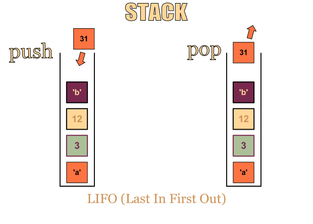

# 목표

* 자료구조와 알고리즘의 개념을 익힙니다.
* 여러 곳에 퍼져있는 유용한 자료들을 한 곳에 모읍니다.
* 각 자료구조와 알고리즘에 해당하는 알고리즘 문제들을 풀어봅니다.

# 목차

## 자료구조

* 연결리스트(Linked List)
* 스택(Stack)
* 큐(Queue)
* 그래프(Graph)
  * 무방향 그래프(Undirected Graph)
  * 방향 그래프(Directed Graph)
* 트리(Tree)
  * 이진 트리(Binary Tree)
    * 이진 탐색 트리(Binary Search Tree)
    * 펜윅 트리(Fenwick Tree)
  * 트라이(Trie)
  * 힙(Heap)
  * 세그먼트 트리(Segment Tree)
* 해쉬 테이블(Hash Table)
* 상호 배타적 집합(Union-Find, Disjoint-set)

## 알고리즘

* 정렬(Sorting)

  * 삽입정렬(Insertion Sort)
  * 선택정렬(Selection Sort)
  * 버블정렬(Bubble Sort)
  * 퀵정렬(Quick Sort)
  * 합병정렬(Merge Sort)
  * 힙정렬(Heap Sort)
  * 계수정렬(Counting Sort)
  * 기수정렬(Radix Sort)
  * 버킷정렬(Bucket Sort)
* 탐색(Searching)

  * 선형탐색(Linear Search)
  * 이진탐색(Binary Search)
  * 삼진탐색(Tenary Search)
* 그래프(Graph)
  * 탐색/정렬(Searching/Sorting)
    * 깊이우선탐색(Depth First Search, DFS)
    * 너비우선탐색(Breath First Search, BFS)
    * 위상정렬(Topological Sort)
  * 최소 스패닝 트리(Minimum Spanning Tree, MST)
      * 크루스칼 알고리즘(Kruskal's algorithm)
      * 프림 알고리즘(Prim's algorithm)
    * 최단 거리(Shortest Path)
        * 다익스트라 알고리즘(Dijkstra's algorithm)
        * 벨만-포드 알고리즘(Bellman-Ford algorithm)
        * 플로이드-와샬 알고리즘(Floyd-Warshall algorithm)
* 문자열(String)
  * KMP 알고리즘(Knuth-Morris-Pratt Algorithm)
  * 라빈 카프 알고리즘(Rabin-Karp Algorithm)
  * 접미사 배열(Suffix Array)
* 백트래킹(Backtracking)
* 다이나믹 프로그래밍(Dynamic Programming)
* 그리디 알고리즘(Greedy Algorithm)

# 자료구조

## 연결 리스트(Linked List)

* [위키백과](https://ko.wikipedia.org/wiki/%EC%97%B0%EA%B2%B0_%EB%A6%AC%EC%8A%A4%ED%8A%B8)
* [Exynoa님의 설명](http://blog.eairship.kr/206?category=431859)
* 노드라고 불리는 것에 데이터를 저장하며 각 노드가 데이터와 포인터를 가지고 한 줄로 연결되어 있는 자료구조.
* **단일 연결 리스트(Singly Linked List)**: 노드의 포인터가 다음 노드를 가리킨다.

* **이중 연결 리스트(Doubly Linked List)**: 노드에 포인터 2개가 있고 각각의 포인터가 앞과 뒤를 가리킨다.

* **원형 연결 리스트(Circular Linked List)**: 마지막 노드의 포인터가 처음 노드를 가리킨다.

* **시간복잡도**:
  * 접근: `O(n)`
  * 탐색: `O(n)`
  * 삽입: `O(1)`
  * 삭제: `O(1)`

## 스택(Stack)

* [위키백과](https://ko.wikipedia.org/wiki/%EC%8A%A4%ED%83%9D)
* [Exynoa님의 설명](http://blog.eairship.kr/210?category=431859)
* 나중에 들어간 데이터가 먼저 나오는 **LIFO(Last In, First Out) 구조**로 데이터를 넣는 것을 푸시(push)라고 하며 꺼내는 것을 팝(pop)이라고 한다.

* **시간복잡도**:
  * 접근: `O(n)`
  * 탐색: `O(n)`
  * 삽입: `O(1)`
  * 삭제: `O(1)`

## 큐(Queue)

* [위키백과](https://ko.wikipedia.org/wiki/%ED%81%90_(%EC%9E%90%EB%A3%8C_%EA%B5%AC%EC%A1%B0))
* [Exynoa님의 설명](http://blog.eairship.kr/213)
* 처음에 들어간 데이터가 처음에 나오는 **FIFO(First In, First Out) 구조**로 `front`와 `rear`라는 변수를 유지하며 삽입(enqueue)과 삭제(dequeue)를 수행한다.
* 선형 큐의 문제점을 환형 큐나 링크드 큐로 보완할 수 있다.

