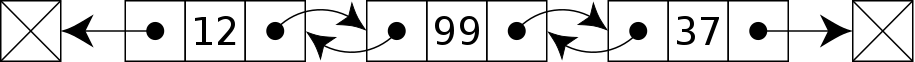

[사진출처](https://medium.com/quick-code/top-tutorials-learn-data-structure-and-algorithm-for-an-interview-preparation-96e1f7518e26)

# 개요

컴퓨터 공학도에게 아주 기본이 되는 덕목인 알고리즘과 자료구조들을 정리하고 공부하기 위한 저장소입니다.
깃헙에서 외국분들이 만든 이런 종류의 저장소를 보기는 했지만 한국어로 된 저장소는 없던 터라 새롭게 만들게 되었습니다. 

혼자 정리한 것이라 부족한 점이 많이 있으니 고쳐야 할 부분은 이슈나 PR 부탁드립니다.
이 저장소를 통해서 저 뿐만 아니라 많은 분들이 도움을 얻었으면 좋겠습니다. :smile:

# 목차

## 자료구조

* [연결 리스트(Linked List)](#linked-list)
* 스택(Stack)
* 큐(Queue)
* 덱(Deque)
* 트리(Tree)
  * 이진 탐색 트리(Binary Search Tree)
  * 트라이(Trie)
  * 힙(Heap)
  * 세그먼트 트리(Segment Tree)
  * 펜윅 트리(Fenwick Tree)
* 해쉬 테이블(Hash Table)
* 상호 배타적 집합(Union-Find, Disjoint-set)

## 알고리즘

* 정렬(Sorting)

  * 삽입정렬(Insertion Sort)
  * 선택정렬(Selection Sort)
  * 버블정렬(Bubble Sort)
  * 퀵정렬(Quick Sort)
  * 합병정렬(Merge Sort)
  * 힙정렬(Heap Sort)
  * 계수정렬(Counting Sort)
  * 기수정렬(Radix Sort)
  * 버킷정렬(Bucket Sort)
* 탐색(Searching)

  * 선형탐색(Linear Search)
  * 이진탐색(Binary Search)
  * 삼진탐색(Tenary Search)
* 그래프(Graph)
  * 탐색/정렬(Searching/Sorting)
    * 깊이우선탐색(Depth First Search, DFS)
    * 너비우선탐색(Breath First Search, BFS)
    * 위상정렬(Topological Sort)
  * 최소 스패닝 트리(Minimum Spanning Tree, MST)
      * 크루스칼 알고리즘(Kruskal's algorithm)
      * 프림 알고리즘(Prim's algorithm)
    * 최단 거리(Shortest Path)
        * 다익스트라 알고리즘(Dijkstra's algorithm)
        * 벨만-포드 알고리즘(Bellman-Ford algorithm)
        * 플로이드-와샬 알고리즘(Floyd-Warshall algorithm)
* 문자열(String)
  * KMP 알고리즘(Knuth-Morris-Pratt Algorithm)
  * 라빈 카프 알고리즘(Rabin-Karp Algorithm)
  * 접미사 배열(Suffix Array)
* 백트래킹(Backtracking)
* 다이나믹 프로그래밍(Dynamic Programming)
* 그리디 알고리즘(Greedy Algorithm)

## 유용한 링크 모음

* **공부자료**
  * [알고리즘 시각화 사이트: VisualAlgo](https://visualgo.net/en)
  * [자료구조 및 알고리즘 시각화 사이트: Data Structure Visualizaitons](https://www.cs.usfca.edu/~galles/visualization/Algorithms.html)
  * [인프런: 권오흠 교수님 알고리즘 강좌](https://www.inflearn.com/course/%EC%95%8C%EA%B3%A0%EB%A6%AC%EC%A6%98-%EA%B0%95%EC%A2%8C/)
  * [빅-오 치트시트](http://bigocheatsheet.com/)
* **Problem Solving 관련 좋은 글**
  * [plzrun, PS 공부를 하면서 좌절감을 느꼈던 글](http://plzrun.tistory.com/entry/PS%EA%B3%B5%EB%B6%80%EB%A5%BC-%ED%95%98%EB%A9%B4%EC%84%9C-%EC%A2%8C%EC%A0%88%EA%B0%90%EC%9D%84-%EB%8A%90%EB%82%80-%EB%B6%84%EB%93%A4%EC%9D%B4-%EC%9D%BD%EC%96%B4%EB%B4%A4%EC%9C%BC%EB%A9%B4-%ED%95%98%EB%8A%94-%EB%82%98%EC%9D%98-2016%EB%85%84)
  * [plzrun, PS 시작하기](http://plzrun.tistory.com/entry/%EC%95%8C%EA%B3%A0%EB%A6%AC%EC%A6%98-%EB%AC%B8%EC%A0%9C%ED%92%80%EC%9D%B4PS-%EC%8B%9C%EC%9E%91%ED%95%98%EA%B8%B0)
  * [dreamoon, 어떻게 알고리즘 대회 실력을 키울 수 있을까(번역)](https://www.acmicpc.net/blog/view/48)
  * [baactree, 알고리즘 공부 방법/순서](http://baactree.tistory.com/14)
  * [koosaga, 내가 문제풀이를 연습하는 방법](http://koosaga.com/217)

# 자료구조

## <a name="linked-list">연결 리스트(Linked List)</a>

* [위키백과](https://ko.wikipedia.org/wiki/%EC%97%B0%EA%B2%B0_%EB%A6%AC%EC%8A%A4%ED%8A%B8) / [블로그 설명](http://blog.eairship.kr/206?category=431859)
* [애니메이션](https://visualgo.net/en/list)
* 노드라는 곳에 데이터를 저장하며 각 노드가 데이터와 포인터를 가지고 한 줄로 연결되어 있는 자료구조.
* **단일 연결 리스트(Singly Linked List)**: 노드의 포인터가 다음 노드를 가리킨다.

* **이중 연결 리스트(Doubly Linked List)**: 노드에 포인터 2개가 있고 각각의 포인터가 앞과 뒤를 가리킨다.

* **환형 연결 리스트(Circular Linked List)**: 마지막 노드의 포인터가 처음 노드를 가리킨다.

* **시간복잡도**:
  * 접근: `O(n)`
  * 탐색: `O(n)`
  * 삽입: `O(1)`
  * 삭제: `O(1)`
* [BOJ 문제](https://www.acmicpc.net/problem/tag/%EB%A7%81%ED%81%AC%EB%93%9C%20%EB%A6%AC%EC%8A%A4%ED%8A%B8)

## 스택(Stack)

* [위키백과](https://ko.wikipedia.org/wiki/%EC%8A%A4%ED%83%9D) / [블로그 설명](http://blog.eairship.kr/210?category=431859)
* [배열로 구현하는 애니메이션](https://www.cs.usfca.edu/~galles/visualization/StackArray.html) 
* [연결 리스트로 구현하는 애니메이션](https://www.cs.usfca.edu/~galles/visualization/StackLL.html)
* 나중에 들어간 데이터가 먼저 나오는 **LIFO(Last In, First Out) 구조**로 데이터를 넣는 것을 푸시(push)라고 하며 꺼내는 것을 팝(pop)이라고 한다.

[사진출처](http://www.stoimen.com/blog/2012/06/05/computer-algorithms-stack-and-queue-data-structure/)

* **시간복잡도**:
  * 접근: `O(n)`
  * 탐색: `O(n)`
  * 삽입: `O(1)`
  * 삭제: `O(1)`
* [BOJ 문제](https://www.acmicpc.net/problem/tag/%EC%8A%A4%ED%83%9D)
* [Programmers 문제](https://programmers.co.kr/learn/courses/30/parts/12081)

## 큐(Queue)

* [위키백과](https://ko.wikipedia.org/wiki/%ED%81%90_(%EC%9E%90%EB%A3%8C_%EA%B5%AC%EC%A1%B0)) / [블로그 설명](http://blog.eairship.kr/213)
* 처음에 들어간 데이터가 처음에 나오는 **FIFO(First In, First Out) 구조**로 `front`와 `rear`라는 변수를 유지하며 삽입(enqueue)과 삭제(dequeue)를 수행한다.
* 선형 큐의 문제점을 <u>환형 큐나 링크드 큐로 보완</u>할 수 있다.

[사진출처](http://www.stoimen.com/blog/2012/06/05/computer-algorithms-stack-and-queue-data-structure/)

* **시간복잡도**
  * 접근: `O(n)`
  * 탐색: `O(n)`
  * 삽입: `O(1)`
  * 삭제: `O(1)`
* [BOJ 문제](https://www.acmicpc.net/problem/tag/%ED%81%90)
* [Programmers 문제](https://programmers.co.kr/learn/courses/30/parts/12081)

## 덱(Deque)

* [위키백과(영어)](https://en.wikipedia.org/wiki/Double-ended_queue) / [블로그 설명](https://blog.naver.com/PostView.nhn?blogId=skout123&logNo=50135774766&proxyReferer=https%3A%2F%2Fwww.google.co.kr%2F)
* 양쪽 끝에서 삽입과 삭제가 모두 가능한 자료구조의 한 형태이다.
* 두 개의 포인터를 사용하여 삽입과 삭제를 수행할 수 있으며 큐와 스택을 합친 형태로 생각할 수 있다.

[사진출처](http://btechsmartclass.com/DS/U2_T11.html)

* **시간복잡도**
  * 접근: `O(n)`
  * 탐색: `O(n)`
  * 삽입: `O(1)`
  * 삭제: `O(1)`
* [BOJ 문제](https://www.acmicpc.net/problem/tag/%EB%8D%B1)

## 트리(Tree)

사이클이 없고 모든 노드가 연결되어있는 연결 그래프를 말한다.

## 이진 탐색 트리(Binary Search Tree)

* [위키백과](https://ko.wikipedia.org/wiki/%EC%9D%B4%EC%A7%84_%ED%83%90%EC%83%89_%ED%8A%B8%EB%A6%AC) / [블로그 설명](https://ratsgo.github.io/data%20structure&algorithm/2017/10/22/bst/)
* 이진트리(Binary Tree)의 한 종류로서 노드의 왼쪽 부분트리에는 해당 노드보다 작은 값들을 지닌 노드들로, 오른쪽 부분트리에는 큰 값들을 지닌 노드들로 이루어져있다.
* 모든 노드가 한쪽방향으로 이어지는 사향트리(Skewed tree)의 경우, 실질적인 효과를 발휘하지 못한다는 단점이 있다.

[GIF 출처](https://www.mathwarehouse.com/programming/gifs/binary-search-tree.php#binary-search-tree-insertion-node)

* **시간복잡도** (단, 사향트리일 경우 전부 `O(n)`)
  * 접근: `O(log n)`
  * 탐색: `O(log n)`
  * 삽입: `O(log n)`
  * 삭제: `O(log n)`
* [BOJ 문제](https://www.acmicpc.net/problem/tag/%EC%9D%B4%EC%A7%84%20%EA%B2%80%EC%83%89%20%ED%8A%B8%EB%A6%AC)

## 트라이(Trie) 

* [위키백과(영어)](https://en.wikipedia.org/wiki/Trie) / [블로그 설명](https://www.crocus.co.kr/1053)
* 접미사 트리(prefix tree)라고 불리는 이 자료구조는 특정 문자열 검색을 할 때 유용하게 쓰인다.
* 각 노드는 문자열이며 원하는 문자열을 `O(1)`에 접근할 수 있도록 주어진 문자열 범위만큼의 배열을 모든 노드가 갖고 있다.
* 메모리를 많이 쓰기 때문에 압축버전인 기수트리(radix tree)로 개선할 수 있다.

[사진출처](https://datastructures.maximal.io/tries/)

* **시간복잡도**
  * 단어의 개수가 n개이고 각 단어의 길이가 m이면 `O(nm)`
* **공간복잡도**
  * 각 노드가 k개의 문자에 대한 레퍼런스를 가져야 한다면 `O(nk)`